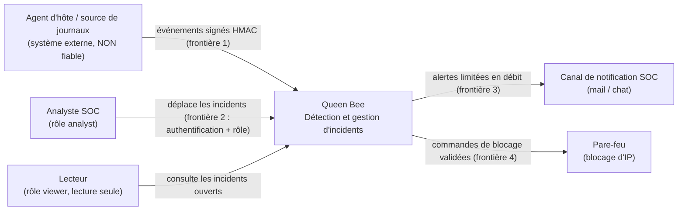

# C4 — Niveau 1 : contexte du système

```mermaid
flowchart LR
    agent["Agent d'hôte / source de journaux\n(système externe, NON fiable)"]
    analyst["Analyste SOC\n(rôle analyst)"]
    viewer["Lecteur\n(rôle viewer, lecture seule)"]
    qb["Queen Bee\nDétection et gestion d'incidents"]
    smtp["Canal de notification SOC\n(mail / chat)"]
    fw["Pare-feu\n(blocage d'IP)"]

    agent -- "événements signés HMAC (frontière 1)" --> qb
    analyst -- "déplace les incidents (frontière 2 : authentification + rôle)" --> qb
    viewer -- "consulte les incidents ouverts" --> qb
    qb -- "alertes limitées en débit (frontière 3)" --> smtp
    qb -- "commandes de blocage validées (frontière 4)" --> fw
```

Frontières de confiance : 1) agent → Queen Bee, 2) utilisateur → Queen Bee, 3) Queen Bee → notification,
4) Queen Bee → pare-feu.
