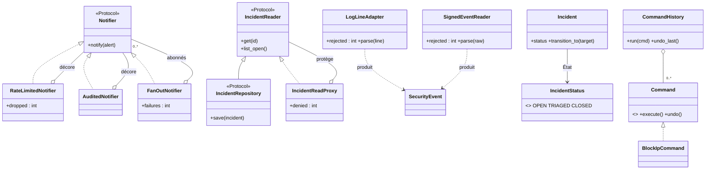

# Diagramme de classes — patterns défensifs

```mermaid
classDiagram
    class Notifier {
        <<Protocol>>
        +notify(alert)
    }
    class RateLimitedNotifier { +dropped : int }
    class AuditedNotifier
    class FanOutNotifier { +failures : int }
    Notifier <|.. RateLimitedNotifier
    Notifier <|.. AuditedNotifier
    Notifier <|.. FanOutNotifier
    RateLimitedNotifier o-- Notifier : décore
    AuditedNotifier o-- Notifier : décore
    FanOutNotifier o-- "0..*" Notifier : abonnés

    class IncidentReader {
        <<Protocol>>
        +get(id)
        +list_open()
    }
    class IncidentRepository {
        <<Protocol>>
        +save(incident)
    }
    class IncidentReadProxy { +denied : int }
    IncidentReader <|.. IncidentReadProxy
    IncidentReader <|-- IncidentRepository
    IncidentReadProxy o-- IncidentReader : protège

    class LogLineAdapter { +rejected : int +parse(line) }
    class SignedEventReader { +rejected : int +parse(raw) }
    LogLineAdapter ..> SecurityEvent : produit
    SignedEventReader ..> SecurityEvent : produit

    class Incident { +status +transition_to(target) }
    class IncidentStatus { <<enumeration>> OPEN TRIAGED CLOSED }
    Incident --> IncidentStatus : État

    class Command { <<Protocol>> +execute() +undo() }
    class BlockIpCommand
    class CommandHistory { +run(cmd) +undo_last() }
    Command <|.. BlockIpCommand
    CommandHistory o-- "0..*" Command
```
